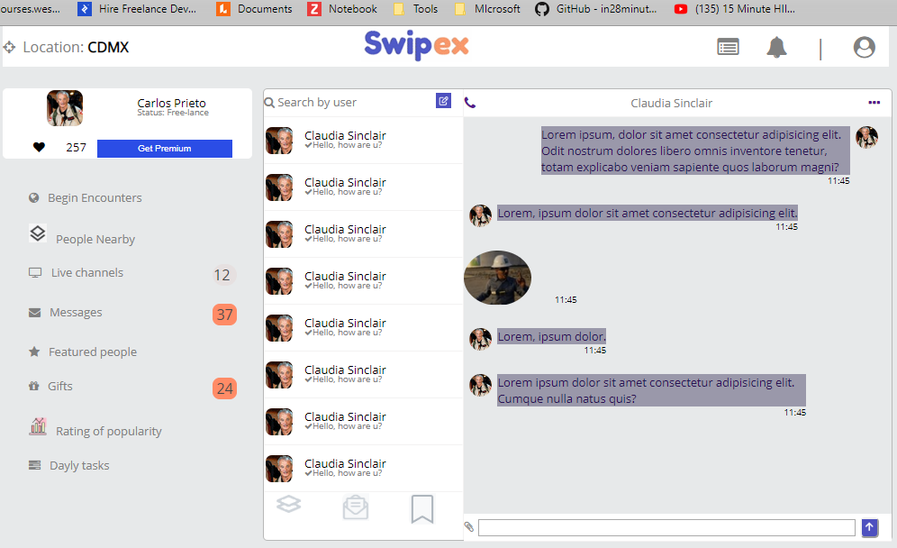
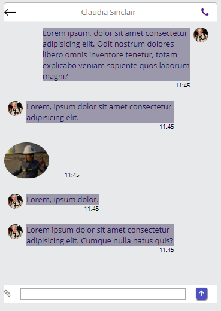

# Swipex Social Network Site

> This is the Capstone project for the HTML and CSS course within the Microverse program.
The objective of this project, it's to create a Social Network site with a page for listing 
all the contacts of the user, from this page he can acces the chat window and the user (contact)
data page with details of the contact.

This page makes extensive and intensive use of advanced CSS Flexbox framework to create the desired 
and attractive layout.

There are two version of this pages, one for desktop devices and the other for mobil devices.

## Built With

- HTML
- fontawesome
- CSS
- Flex-box

##LINK TO THE ORIGINAL CONCEPT BY : Vlad Ermakov on Dribbble

#[Original Concept](https://dribbble.com/ermalength)

##[Link to a video presentation and demo](https://www.loom.com/share/da0196b55fa740aea9b72eef7d0a9d4a)

##Here are some Screen Shots of the Desktop Version

#Contacts Page

#Chat Page

#Contact Details Page

##Here are some Screen Shots of the Movil Devices Version
#Contacts Page

#Chat Page

#Contact Details Page

## Live Demo

[Swipex Demo](https://rawcdn.githack.com/carlosprietobarron/capstone-socialnet/a8d20f2a0ffdac6812186e4b8020f48c0b05fbb5/index.html)

## Authors

👤 Carlos Prieto Barron

- Github: [@carlosprietobarron](https://github.com/carlosprietobarron)

👤 

## 🤝 Contributing

Contributions, issues and feature requests are welcome!

Feel free to check the [issues page](issues/).

## Show your support

Give a ⭐️ if you like this project!

## Acknowledgments

- Hat tip to anyone whose code was used
- Inspiration
- etc

## 📝 License

This project is [MIT](lic.url) licensed.
